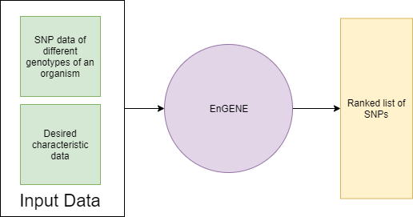
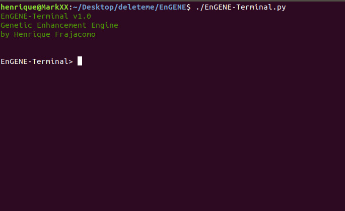
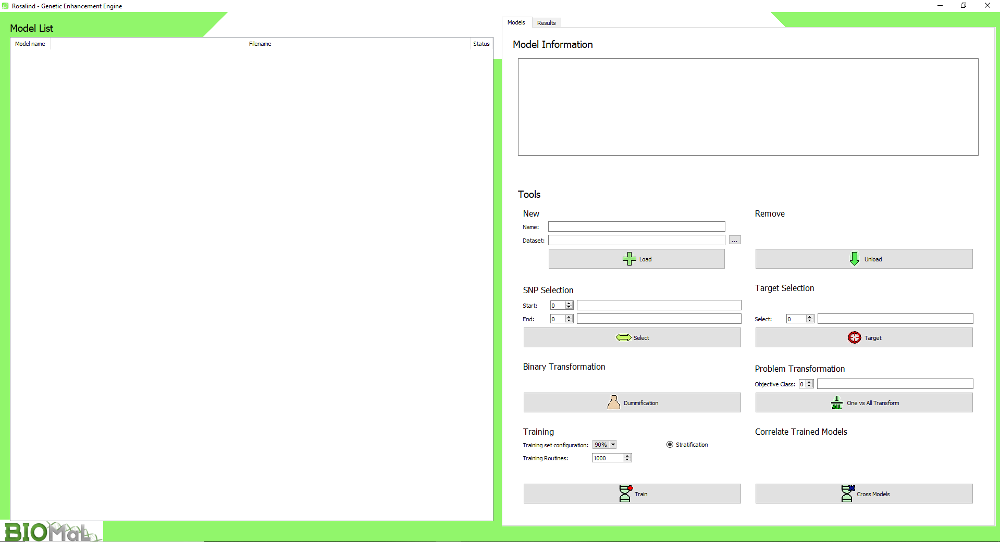

Genex

# EnGENE

EnGENE is an AI powered Genetic Enhancement Engine for biologists and data scientists.

### A brief biology background

Genetics is an area of biology that studies DNA and genomics. A DNA is (in real life) a molecule composed of two chains of data that describes an organism. While it's imaginable that the DNA of a human and a grain of rice is different, the examples given here are specific to a single organism... so let's focus on humans!

As humans, we have our differences, even though we share the same DNA structure. So what makes us different? The answer is simple: DNA. It sounds quite complicated, but let me clear things our for you: 99% of our DNA is what makes us human, the other 1% is what makes us... us. That 1% DNA data is what we call **Single Nucleotide Polymorphisms (SNPs)**.

SNPs are basically a piece of DNA that is interchangeable throughout the species. Those dictate our appearance, bodily processes, tendency to diseases, etc..

In Genetic Enhancement, the main goal of the researchers is to find the SNPs that are related to a certain target characteristic of an organism. As another example, let's say that we want to make a certain crop grow faster. We first have to look at it's SNP string and figure out what SNPs are related to the "grow faster" characteristic. After that, researchers perform experiments to get a genotype that has that SNP set to a value that makes the "grow faster" characteristic more prominent. The problem is that organisms can have thousands and thousands of SNPS. Some easily get to the hundreds of thousands. How do we find one or a few SNPs that are related to our target characteristic? That's what EnGENE is for!

## Installation

EnGENE can be used through the a terminal interface (EnGENE-Terminal) or Rosalind GUI. Both of them run on **Python3**. The installation can be done by following a few steps:

### Windows

 1. Download the latest version of Python3 [here](https://www.python.org/downloads/)
 2. Download EnGENE. It can either be downloaded straight from Github or can be cloned directly into your computer if Git is installed.

	> git clone https://github.com/HFrajacomo/EnGENE

 3. Open a cmd or powershell in the EnGENE directory and run the setup files:

	For EnGENE-Terminal
	> python setup.py

	For Rosalind GUI
	> python setup_rosalind.py

 4. Now, to run EnGENE just run:
 
	For EnGENE-Terminal
	> python EnGENE-Terminal.py	
	
	For Rosalind GUI
	> python Rosalind.pyw	

### Linux

 1. Getting EnGENE:
	
	> git clone https://github.com/HFrajacomo/EnGENE
	
	> cd EnGENE
	
2. Installing EnGENE dependencies:
	
	For EnGENE-Terminal:

	> ./setup.py
		
	For Rosalind GUI:
	
	> ./setup_rosalind.py

3. Running EnGENE can be done by:

> ./EnGENE-Terminal.py
> ./Rosalind.pyw

## The Dataset

An example of input dataset for EnGENE to analyze must meet **three** requirements:

 1. It must contain all SNP data for all genotypes. No missing values are permitted.
 2. Their columns must relate to a SNP, while rows must be genotypes.
 3. An additional column (preferably the last one) must contain a metric class for the target characteristic you are looking for

An example would be:

| Genotype | SNP1 | SNP2 | SNP3 | Growth_rate|
|--|--|--|--|--|
| Gen1 | A | C | T | Low
| Gen2 | G | T | C | Low
| Gen3 | T | T | C | High
| Gen4 | G| C | C | Medium

A dataset like that would be accepted, but won't be ready for the AI. There are transformations that can be done inside EnGENE environment to turn the data into *usable data*. 

## The Environment

EnGENE works by taking a specifically prepared dataset and training multiple AI models to better undestand the SNP structure. 

EnGENE-Terminal is a terminal interface for manipulating EnGENE functions and classes. There, you have complete freedom towards parameters, arguments and transformations.

Start with the simple **help** command and go from there!

Rosalind is a Graphic User Interface (GUI) for EnGENE. There, you have a simplified environment for working with data. **Rosalind is recommended for those not fond of Computer Science**.

Start loading a dataset into Rosalind and preparing it for training!

## Credits

EnGENE was developed by Henrique Frajacomo, researcher in BioMaL lab based at Federal University of São Carlos - Brazil.